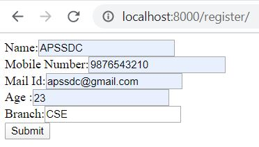
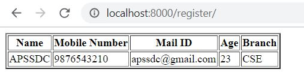

## Data Rendering From Views to Html in Static
-----
### What is a render?

It Combines a given template with a given context dictionary and returns an HttpResponse object with that rendered text.

### How to import render?

In views.py we should have to import render as follows **from django.shortcuts import render**

### How many arguments does render takes?

Render takes upto 6 argumnets i.e, Required arugumnets are 2 Optional arguments are 4

***Required Argumnets***:
  - **request**: Used to generate the response
  - **template name**: It will call the HTML Page which it is existed in the template folder

***Optional Arguments***:
  - **context**: A dictionary of values to add to the template context. By default, this is an empty dictionary. If a value in the                        dictionary is callable, the view will call it just before rendering the template.
  - **content_type**: The MIME type to use for the resulting document. Defaults to 'text/html'.
  - **status**: The status code for the response. Defaults to 200.
  - **using**: The NAME of a template engine to use for loading the template.

> How ever we will use upto 3 argumnets maximum(request,template name,context(dictionary)

***Steps to implement render from views to html and html to views***

- In views.py first we should have to import a render
- Create a view(Function) in views.py
- Create a template file(HTML File) which is to be rendered and link it to the view.
- Create a URL to map to that view

Let us create a simple template that shows the current date and time as discussed earlier we will follow those steps to get desired result.

For this project i created one application i.e, testapp is my application name and i created one function show inside the views.py, to display output i created one templated called display.html

**Views.py**
----


**display.html**
----


**urls.py**
----


**Result**
----


----

## Data rendering from html to views without using forms and models

----
***Steps as follows***

- Created one application i.e, apssdc is my application name
- In this we will create a simple template(html file) which includes some fields like name,Mobile Number,Mail Id
- Here total we consired 3 fields in our application so that we require 3 input fields and one submit button
- To display the output create another template

**Views.py**
----


**index.html**
----


**result.html**
----


**urls.py**
----


**Result**
----



**After click on submit result shown as follows**



-----------
## Form Handling using a basic procedure with bootstrap4. 

### What is The Form?
* Form (HTML) A webform, web form or HTML form on a web page allows a user to enter data that is sent to a server for processing. Forms can resemble paper or database forms because web users fill out the forms using checkboxes, radio buttons, or text fields.
### Where Forms are using?
* HTML Forms are required when you want to collect some data from the site visitor.
  * For example during user registration you would like to collect information such as name, email,address, credit card, etc.
* A form will take input from the site visitor and then will post it to a back-end application such as Django,Flask,CGI, ASP Script or PHP script etc.
* The back-end application will perform required processing on the passed data based on defined business logic inside the application.
### HTML Form Syntax
```Html
<form action="server url" method="get|post">  
  //input controls e.g. textfield, textarea, radiobutton, button  
</form> 
```
### HTML Form Tags
<table class="alt">
<tr><th>Tag</th><th>Description</th></tr>
<tr><td>&lt;form&gt;</td><td>It defines an HTML form to enter inputs by the used side.</td></tr>
<tr><td>&lt;input&gt;</td><td>It defines an input control.</td></tr>
<tr><td>&lt;textarea&gt;</td><td>It defines a multi-line input control.</td></tr>
<tr><td>&lt;label&gt;</td><td>It defines a label for an input element.</td></tr>
<tr><td>&lt;fieldset&gt;</td><td>It groups the related element in a form.</td></tr>
<tr><td>&lt;legend&gt;</td><td>It defines a caption for a &lt;fieldset&gt; element.</td></tr>
<tr><td>&lt;select&gt;</td><td>It defines a drop-down list.</td></tr>
<tr><td>&lt;optgroup&gt;</td><td>It defines a group of related options in a drop-down list.</td></tr>
<tr><td>&lt;option&gt;</td><td>It defines an option in a drop-down list.</td></tr>
<tr><td>&lt;button&gt;</td><td>It defines a clickable button.</td></tr>
</table>

### HTML &lt;form&gt; element
* The HTML <form> element provide a document section to take input from user. It provides various interactive controls for submitting information to web server such as text field, text area, password field, etc.

> Note: The <form> element does not itself create a form but it is container to contain all required form elements, such as <input>, <label>, etc.

### Syntax:
~~~ Html
<form>  
//Form elements  
</form>
~~~~

### HTML &lt;input&gt; element
  * The HTML <input> element is fundamental form element. It is used to create form fields, to take input from user. We can apply different input filed to gather different information form user. Following is the example to show the simple text input.
### Example
~~~ Html
<form>  
     Enter your name  <br>  
    <input type="text" name="username">  
  </form>
~~~
]

### HTML TextField Control
* The type="text" attribute of input tag creates textfield control also known as single line textfield control. The name attribute is optional, but it is required for the server side component such as JSP, ASP, PHP etc.
### Example
~~~ Html
<form>  
    First Name: <input type="text" name="firstname"/> <br/>  
    Last Name:  <input type="text" name="lastname"/> <br/>  
 </form> 
~~~
]
> Note: If you will omit 'name' attribute then the text filed input will not be submitted to server.

### HTML textarea tag in form
* The <textarea> tag in HTML is used to insert multiple-line text in a form. The size of <textarea> can be specify either using "rows" or "cols" attribute or by CSS.

### Example:
 ~~~ Html
 <form>  
        Enter your address:<br>  
      <textarea rows="2" cols="20"></textarea>  
  </form> 
 ~~~
 ]
 
### Label Tag in Form
* It is considered better to have label in form. As it makes the code parser/browser/user friendly.
* If you click on the label tag, it will focus on the text control. To do so, you need to have for attribute in label tag that must be same as id attribute of input tag.

> NOTE: It is good to use <label> tag with form, although it is optional but if you will use it, then it will provide a focus when you tap or click on label tag. It is more worthy with touchscreens.

~~~ Html
<form>  
    <label for="firstname">First Name: </label> <br/>  
              <input type="text" id="firstname" name="firstname"/> <br/>  
   <label for="lastname">Last Name: </label>  
              <input type="text" id="lastname" name="lastname"/> <br/>  
 </form>  
~~~
]

### HTML Password Field Control
* The password is not visible to the user in password field control.
### Example
~~~ Html
<form>  
    <label for="password">Password: </label>  
              <input type="password" id="password" name="password"/> <br/>  
</form>  
~~~
]

### HTML Email Field Control
* The email field in new in HTML 5. It validates the text for correct email address. You must use @ and . in this field.
~~~ Html
<form>  
    <label for="email">Email: </label>  
              <input type="email" id="email" name="email"/> <br/>  
</form>  
~~~
]

> Note: If we will not enter the correct email, it will display error like:
]

### Radio Button Control
* The radio button is used to select one option from multiple options. It is used for selection of gender, quiz questions etc.

* If you use one name for all the radio buttons, only one radio button can be selected at a time.

* Using radio buttons for multiple options, you can only choose a single option at a time.

~~~ Html
<form>  
    <label for="gender">Gender: </label>  
              <input type="radio" id="gender" name="gender" value="male"/>Male  
              <input type="radio" id="gender" name="gender" value="female"/>Female <br/>  
</form>  
~~~


]

### Checkbox Control
* The checkbox control is used to check multiple options from given checkboxes.
~~~ Html
<form>  
Hobby:<br>  
              <input type="checkbox" id="cricket" name="cricket" value="cricket"/>  
                 <label for="cricket">Cricket</label> <br>  
              <input type="checkbox" id="football" name="football" value="football"/>  
                 <label for="football">Football</label> <br>  
              <input type="checkbox" id="hockey" name="hockey" value="hockey"/>  
                 <label for="hockey">Hockey</label>  
</form>  
~~~
> Note: These are similar to radio button except it can choose multiple options at a time and radio button can select one button at a time, and its display.

]

### Submit button control
* HTML <input type="submit"> are used to add a submit button on web page. When user clicks on submit button, then form get submit to the server.
### Syntax:
~~~ Html
<input type="submit" value="submit">  
~~~
* The type = submit , specifying that it is a submit button

* The value attribute can be anything which we write on button on web page.

* The name attribute can be omit here.
### Example
~~~ Html
<form>  
    <label for="name">Enter name</label><br>  
    <input type="text" id="name" name="name"><br>  
    <label for="pass">Enter Password</label><br>  
    <input type="Password" id="pass" name="pass"><br>  
    <input type="submit" value="submit">  
</form>  
~~~

]

### HTML <fieldset> element:
 * The <fieldset> element in HTML is used to group the related information of a form. This element is used with <legend> element which provide caption for the grouped elements.
### Example
 ~~~ Html
 <form>  
     <fieldset>  
      <legend>User Information:</legend>  
    <label for="name">Enter name</label><br>  
<input type="text" id="name" name="name"><br>  
<label for="pass">Enter Password</label><br>  
<input type="Password" id="pass" name="pass"><br>  
<input type="submit" value="submit">  
</fieldset>  
</form>  
 ~~~


### Forms with Bootstrap 4

### Bootstrap Form Layouts
 * Bootstrap provides three types of form layouts:
  * Vertical form (this is default)
  * Horizontal form
  * Inline form
  * Standard rules for all three form layouts:
  * Wrap labels and form controls in <div class="form-group"> (needed for optimum spacing)
  * Add class .form-control to all textual <input>, <textarea>, and <select> elements

### Bootstrap Vertical Form (default)
 * The following example creates a vertical form with two input fields, one checkbox, and a submit button:
